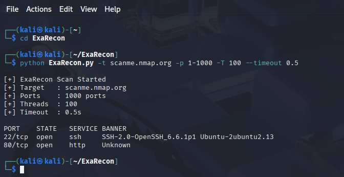

# ExaRecon 🔍 (v2)

ExaRecon is a lightweight, modular Python-based network reconnaissance tool designed to enumerate open TCP ports and fingerprint running services using banner grabbing techniques.

Built for learning, lab environments, and ethical security research.

---

## 🚀 What’s New in v2

- Modular architecture
- CLI-based execution with argparse
- Multi-threaded scanning for speed
- Custom port ranges (single, range, comma-separated)
- Configurable timeout handling
- Cleaner, structured output
- Improved error handling

---

## 🧠 Why ExaRecon Exists

During the **reconnaissance phase**, attackers and penetration testers:

- Enumerate open ports  
- Identify exposed services  
- Fingerprint software versions  
- Map the attack surface  

ExaRecon mirrors this workflow in a **controlled, ethical learning environment**, helping you understand *how attackers think* before exploitation even begins.

---

## ⚙️ How It Works (High-Level)

1. Parses user-supplied port ranges
2. Establishes TCP connections using Python sockets
3. Uses multi-threading for faster scans
4. Performs banner grabbing where possible
5. Maps ports to common services
6. Displays results for further enumeration

---

## 🧪 Supported Service Detection

- SSH
- FTP
- HTTP / HTTPS
- SMB
- RDP
- Databases (MySQL, PostgreSQL, Redis)
- Mail services (SMTP, POP3, IMAP)
- And more

---

## 📸 Screenshots



## ▶️ Usage

```bash
python ExaRecon.py -t <target> -p <ports> -T <threads> --timeout <seconds>
